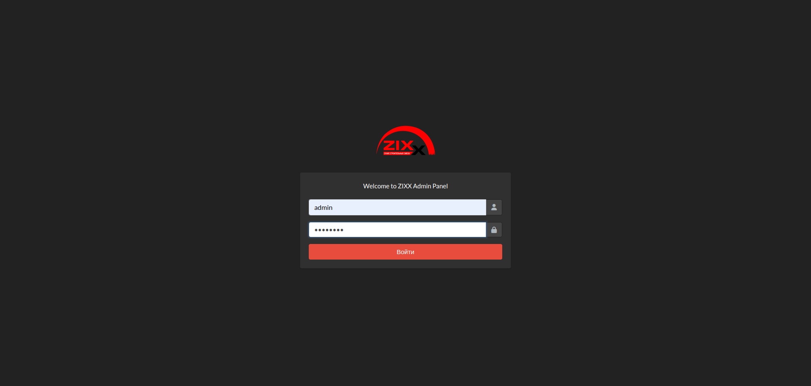
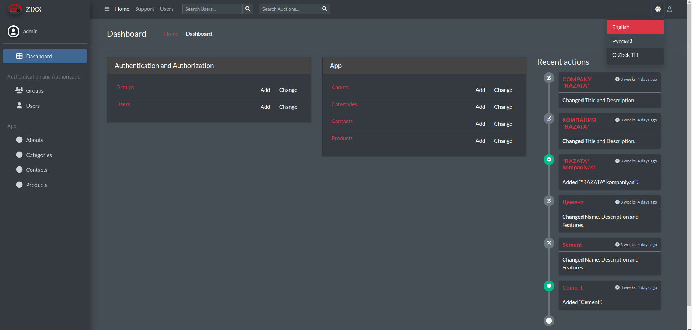

# ZIXX Project Setup Guide

## Overview
This guide provides detailed instructions on setting up the ZIXX project, a Django-based application designed for managing construction materials efficiently.

## Prerequisites
- Python 3.8 or higher
- pip (Python package installer)
- Virtualenv (optional but recommended for environment isolation)

## Step-by-Step Installation

### 1. Clone the Repository
Clone the ZIXX repository from GitHub to your local machine using the command:
```bash
git clone https://github.com/ikramovna/zix.git
```

### 2. Create a Virtual Environment (Optional)
Create a virtual environment to isolate the project dependencies from other Python projects. Run the following command:
```bash
python -m venv zixx-env
```

### 3. Activate the Virtual Environment
Activate the virtual environment using the appropriate command for your operating system:
- **Windows**: `.\zixx-env\Scripts\activate`
- **macOS/Linux**: `source zixx-env/bin/activate`
- You should see the virtual environment name in the terminal prompt.
- To deactivate the virtual environment, run the command `deactivate`.
- If you are not using a virtual environment, skip this step.
- If you are using a virtual environment, make sure it is activated before proceeding to the next steps.

### 4. Install Required Packages
Navigate to the project directory and install the required Python packages using the following command:
```bash
pip install -r requirements.txt
```

### 5. Set Up the Database
Create the database tables by running the following commands:
```bash
python manage.py makemigrations
python manage.py migrate
```

### 6. Create a Superuser
Create a superuser account to access the Django admin interface:
```bash
python manage.py createsuperuser
```

### 7. Run the Development Server
Start the Django development server using the command:
```bash
python manage.py runserver
```
Visit http://127.0.0.1:8000/ in your browser.

### Project Structure
- **zixx/**: Main project directory
- **materials/**: Django app for managing construction materials
- **templates/**: HTML templates for the frontend
- **static/**: Static files (CSS, JS, images)
- **media/**: User-uploaded files (images, documents)
- **manage.py**: Django management script
- **requirements.txt**: List of Python packages required for the project
- **README.md**: Project setup guide
- **.gitignore**: List of files and directories to ignore in Git
- **.env**: Environment variables file (not included in the repository)

### Project Overview
The ZIXX project is a web application that allows users to manage construction materials efficiently. It includes features such as:
- Material creation, editing, and deletion
- Category management
- Supplier management
- User authentication and authorization
- User profile management
- Search functionality
- File uploads (images, documents)
- Responsive design for mobile and desktop
- Django admin interface for managing data
- Custom error pages
- Pagination of material listings
- User-friendly URLs

### Main Website Interface:
Displays the homepage of the ZIXX website which highlights their key product offerings and business value—specifically aimed at improving accessibility and efficiency in sourcing construction materials. The website features a clean, professional design with easy navigation to different sections such as company info, products, and contacts.

#### Screenshots:
***


***

### About Us:

The About Us page provides detailed information about the company, its mission, vision, and values. It also includes a brief history of the company and its key milestones. The page is designed to build trust and credibility with potential customers by showcasing the company's expertise and experience in the construction materials industry.

#### Screenshots:
***


***

### Admin Interface:
The Django admin interface provides an easy-to-use dashboard for managing the ZIXX website's content, users, and settings. It allows administrators to add, edit, and delete materials, categories, suppliers, and users. The admin interface also includes features for managing user permissions, groups, and profiles.

#### Screenshots:
***



***

### Dashboard:

The Dashboard page displays key performance indicators (KPIs) and analytics related to the ZIXX website's performance. It includes metrics such as total materials, categories, suppliers, and users. The dashboard provides a quick overview of the website's activity and engagement levels.

#### Screenshots:
***


***


